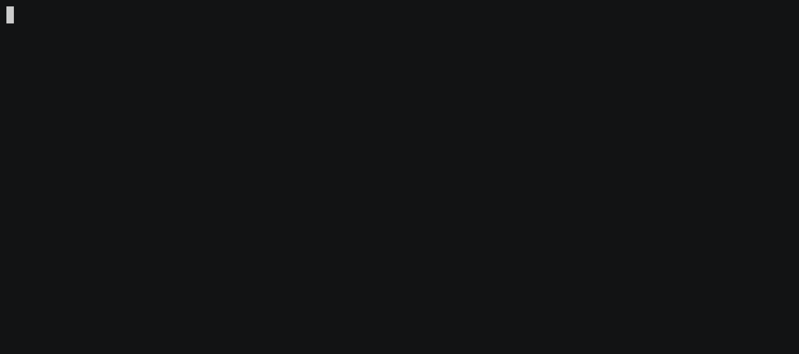

# Introduction

> cargo, make me a project

`cargo-generate` is a developer tool to help you get up and running quickly with a new Rust
project by leveraging a pre-existing git repository as a template.

cargo-generate uses [Shopify's Liquid](http://liquidmarkup.org/) template language,
[Rhai](https://docs.rs/rhai/latest/rhai/) for hook scripts and [regex](https://docs.rs/regex/latest/regex/) for placeholders.

Here's an example of using `cargo-generate` with [this template]:

[this template]: https://github.com/ashleygwilliams/wasm-pack-template
